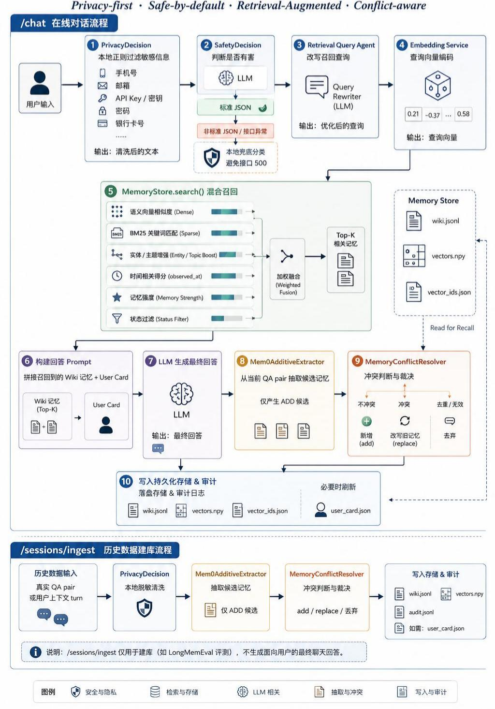

# Long-Term Memory Agent

本项目分为三大块：

1. `memory_system/`：长期记忆系统主体，提供记忆写入、召回、冲突更新、隐私/安全过滤、User Card 和 API。
2. `longmemeval_memory_pipeline/`：LongMemEval 两阶段测试流程，先为每道题建独立记忆库，再用 raw question top-6 召回答题。
3. `memory_feature_demos/`：功能 demo，展示基础召回、冲突更新、隐私过滤和 User Card，并可生成直观 Markdown 报告。

项目代码会自动从当前文件位置识别仓库根目录，不再依赖固定的 `/home/.../memory` 路径。默认情况下，主记忆库、运行日志、模型目录等都相对于仓库根目录解析。

## 目录结构

```text
memory/
├── memory_system/                 # 主体记忆系统
├── longmemeval_memory_pipeline/    # LongMemEval 标准化测试模块
├── memory_feature_demos/           # 功能 demo 和报告生成
├── scripts/                        # 服务启动、停止和 smoke test
├── LongMemEval/                    # LongMemEval 脚本和说明；数据文件不随 GitHub 提交
├── data/                           # 默认主记忆库输出，建议不提交
├── runtime/                        # 运行日志和实验输出，建议不提交
└── .env.example                    # 环境变量模板
```

## 环境配置

推荐使用 Python 3.12 和 conda 环境 `memory`：

```bash
conda create -n memory python=3.12
conda activate memory
pip install -r requirements.txt
```

复制环境变量模板：

```bash
cp .env.example .env
```

常用配置项：

```bash
# 推荐：vLLM OpenAI-compatible embedding 服务
EMBEDDING_PROVIDER=vllm
EMBEDDING_SERVICE_URL=http://127.0.0.1:18083/v1
EMBEDDING_MODEL=bge-m3
EMBEDDING_API_KEY=EMPTY

# Memory API
MEMORY_API_HOST=127.0.0.1
MEMORY_API_PORT=18082

# DeepSeek
LLM_PROVIDER=deepseek
LLM_BASE_URL=https://api.deepseek.com
LLM_API_KEY=
DEEPSEEK_API_KEY=
LLM_MODEL=deepseek-v4-flash

# Qwen / DashScope, 用于 LongMemEval 答题阶段
ALIYUN_BASE_URL=https://dashscope.aliyuncs.com/compatible-mode/v1
ALIYUN_API_KEY=
DASHSCOPE_API_KEY=
ALIYUN_MODEL=qwen3.5-27b
```

`MEMORY_ROOT` 通常不需要设置。若不设置，系统会自动把仓库根目录识别为主目录。只有在你明确想把记忆库存到别的位置时，才需要在 shell 环境里覆盖：

```bash
export MEMORY_ROOT=/path/to/custom/memory_root
```

## 路径自动识别

路径策略如下：

- `memory_system/config.py` 默认用 `memory_system/` 的父目录作为项目根目录。
- `scripts/*.sh` 和 `memory_feature_demos/run_*.sh` 会根据脚本自身位置定位仓库根目录。
- `memory_feature_demos/demo_manifest.json` 使用相对路径，例如 `memory_feature_demos/memory_banks/basic_recall`。
- LongMemEval 模块默认输入和输出也都基于仓库根目录：`LongMemEval/...` 和 `runtime/longmemeval_memory_pipeline/...`。

因此项目上传到 GitHub 后，clone 到任意路径都可以运行，不需要修改代码中的绝对路径。

## 数据和模型权重

公开仓库只提交代码、prompt、脚本和说明文档，不提交以下内容：

- `.env`：本地 API key 和服务配置；
- `LongMemEval/*.json`、`*.jsonl` 等数据集文件；
- `bge-m3/`：本地 embedding 模型权重；
- `data/`、`runtime/`、`result/`：运行产物、日志、实验结果和默认记忆库；
- `memory_feature_demos/memory_banks/*/data/`、`memory_feature_demos/run_logs/`、`memory_feature_demos/reports/`：demo 运行结果。

如果需要运行 LongMemEval，请自行把数据文件放回：

```text
LongMemEval/longmemeval_s_cleaned.json
LongMemEval/longmemeval_m_cleaned.json
LongMemEval/longmemeval_s_sampled_100.json
```

如果使用本地 vLLM embedding 服务，请自行准备 `bge-m3/` 模型目录，或在环境变量中把 `EMBEDDING_MODEL` 指向可用模型路径。

## 一、主体记忆系统

主体代码在 `memory_system/`，核心文件：

- `api.py`：FastAPI 服务入口，提供 `/chat`、`/sessions/ingest`、`/search`、`/wiki/edit`、`/user-card/refresh` 等接口。
- `store.py`：本地 Wiki 记忆库、向量存储、BM25、实体 boost、时间 boost、遗忘/删除和审计日志。
- `mem0_style.py`：mem0 风格 ADD-only 抽取器。
- `conflict_resolver.py`：独立冲突判断器，只判断候选记忆是否和旧记忆冲突。
- `privacy.py`：本地敏感信息规则过滤。
- `safety.py`：有害内容安全分类，包含 LLM 输出异常时的本地兜底。
- `user_card.py`：从稳定记忆中总结用户画像。
- `prompts.py`：问答、记忆抽取、冲突判断、User Card 等 prompt。

### 主体运行

启动 vLLM embedding 服务：

```bash
bash scripts/start_vllm_embedding_server.sh
```

启动 Memory API：

```bash
bash scripts/start_memory_api.sh
```

停止服务：

```bash
bash scripts/stop_services.sh
```

Smoke test：

```bash
bash scripts/smoke_test.sh
```

### 单纯聊天

日常聊天推荐使用交互式入口，不需要手写 `curl`：

```bash
bash scripts/chat.sh
```

常用启动方式：

```bash
# 指定会话 ID；同一个 session 会自动带最近几轮对话历史
bash scripts/chat.sh --session qiukaixiang

# 修改每轮召回的记忆数量，默认 top_k=4
bash scripts/chat.sh --top-k 8

# 指定独立记忆库；相对路径会按项目根目录解析
bash scripts/chat.sh --memory-root runtime/chat_banks/qiukaixiang

# 同时指定会话、记忆库和召回数量
bash scripts/chat.sh --session qiukaixiang --memory-root runtime/chat_banks/qiukaixiang --top-k 6
```

参数含义：

- `--session`：选择聊天会话 ID，只影响最近对话历史保存到哪个 `data/sessions/<session_id>.jsonl`。
- `--memory-root`：选择记忆库位置，决定 `wiki.jsonl`、`vectors.npy`、`user_card.json` 等文件写到哪里。
- `--top-k`：每轮回答时召回多少条记忆。

交互模式内置命令：

```text
/new [session]     开启新会话
/session <id>      切换 session_id
/topk <n>          修改每轮召回数量
/debug on|off      是否显示召回记忆和记忆更新
/memories [n]      查看记忆库中最近 n 条记忆
/card              查看 User Card
/exit              退出
```

`scripts/chat.sh` 会自动检查并启动 vLLM embedding 服务和 Memory API。如果端口上已经有 Memory API 在运行，且它使用的 `memory_root` 和你传入的 `--memory-root` 不一致，CLI 会提示先停止旧服务或换端口，避免误写到旧记忆库。

### 主要接口

聊天接口：

```bash
curl -s http://127.0.0.1:18082/chat \
  -H 'Content-Type: application/json' \
  -d '{"session_id":"demo","user_input":"我喜欢简洁的 Python 示例","top_k":4}'
```

召回接口：

```bash
curl -s http://127.0.0.1:18082/search \
  -H 'Content-Type: application/json' \
  -d '{"query":"Python 示例偏好","top_k":5}'
```

刷新 User Card：

```bash
curl -s -X POST 'http://127.0.0.1:18082/user-card/refresh?limit=30'
```

### 记忆流程



`chat` 的流程：
1. 用户输入进入 `PrivacyDecision`，本地正则过滤手机号、邮箱、key、密码、银行卡等敏感信息。
2. 进入 `SafetyDecision`，判断是否有害；若 LLM 返回非标准 JSON，使用本地兜底分类，避免接口 500。
3. 由 retrieval query agent 改写召回查询。
4. embedding 服务对查询编码。
5. `MemoryStore.search()` 混合召回：
   - 语义向量相似度；
   - BM25 关键词匹配；
   - entity/topic boost；
   - `observed_at` 时间相关得分；
   - memory strength 和状态过滤。
6. 用召回到的 Wiki 记忆和 User Card 拼接回答 prompt。
7. LLM 生成最终回答。
8. `Mem0AdditiveExtractor` 从当前 QA pair 中抽取候选记忆，只产生 ADD 候选。
9. `MemoryConflictResolver` 对候选记忆和相关旧记忆做冲突判断：
   - 不冲突：新增为 `add`；
   - 冲突：改写旧记忆为 `replace`；
   - 不让 extractor 同时承担抽取和冲突裁决。
10. 写入 `wiki.jsonl`、`vectors.npy`、`vector_ids.json`、`audit.jsonl`，必要时刷新 `user_card.json`。

`/sessions/ingest` 用于历史数据建库，尤其是 LongMemEval。它按真实 QA pair 或用户上下文 turn 写入记忆，不生成面向用户的最终聊天回答。

### 主体存储文件

默认主记忆库在仓库根目录的 `data/` 下：

```text
data/wiki.jsonl          # Wiki 记忆记录
data/vectors.npy         # 向量矩阵
data/vector_ids.json     # 向量行与 memory id 的映射
data/audit.jsonl         # 写入、替换、删除审计日志
data/user_card.json      # 用户画像
data/sessions/*.jsonl    # 会话原文
```

## 二、LongMemEval 测试

标准化模块在 `longmemeval_memory_pipeline/`。它分两步：

1. `build_banks.py`：对每道 LongMemEval 题目建立独立记忆库。
2. `answer_raw_top6.py`：用原始问题 `question` 做召回，取 top-6 raw memories，拼到 chat prompt 中让 Qwen 回答。

推荐先确保 embedding 服务已启动：

```bash
bash scripts/start_vllm_embedding_server.sh
```

### Stage 1：建库

```bash
conda run -n memory python -m longmemeval_memory_pipeline.build_banks \
  --input LongMemEval/longmemeval_s_cleaned.json \
  --output-root runtime/longmemeval_memory_pipeline/memory_banks \
  --provider deepseek \
  --model deepseek-v4-flash \
  --embedding-url http://127.0.0.1:18083/v1 \
  --embedding-provider vllm \
  --embedding-model bge-m3
```

每道题会写到独立目录：

```text
runtime/longmemeval_memory_pipeline/memory_banks/<question_type>__<question_id>/
├── data/wiki.jsonl
├── data/vectors.npy
├── data/user_card.json
└── runtime/api_io.jsonl
```

常用参数：

- `--limit N`：只跑前 N 条。
- `--question-id ID`：只跑指定题目，可重复。
- `--question-type TYPE`：只跑指定类型，可重复。
- `--resume`：跳过已完成题目。
- `--overwrite`：重建已有记忆库。
- `--dry-run-plan`：只打印计划，不启动服务或调用模型。

### Stage 2：raw question top-6 召回并回答

```bash
conda run -n memory python -m longmemeval_memory_pipeline.answer_raw_top6 \
  --input LongMemEval/longmemeval_s_cleaned.json \
  --memory-bank-root runtime/longmemeval_memory_pipeline/memory_banks \
  --output runtime/longmemeval_memory_pipeline/raw_top6_qwen_predictions.jsonl \
  --top-k 6 \
  --embedding-url http://127.0.0.1:18083/v1 \
  --embedding-provider vllm \
  --embedding-model bge-m3
```

输出：

```text
runtime/longmemeval_memory_pipeline/raw_top6_qwen_predictions.jsonl
runtime/longmemeval_memory_pipeline/raw_top6_qwen_predictions.json
runtime/longmemeval_memory_pipeline/raw_top6_qwen_predictions.md
```

### 一键两阶段

```bash
conda run -n memory python -m longmemeval_memory_pipeline.run_two_stage \
  --input LongMemEval/longmemeval_s_cleaned.json \
  --run-root runtime/longmemeval_memory_pipeline \
  --build-provider deepseek \
  --build-model deepseek-v4-flash \
  --answer-model qwen3.5-27b \
  --top-k 6
```

## 三、功能 Demo

Demo 模块在 `memory_feature_demos/`，包括四个独立 demo：

- `basic_recall`：基础写入与召回。
- `conflict_update`：冲突更新，新偏好替换旧偏好。
- `privacy_filtering`：敏感信息不入库，非敏感偏好保留。
- `user_card`：稳定偏好总结为 User Card，并影响 probe 回答。

每个 demo 有独立记忆库：

```text
memory_feature_demos/memory_banks/<demo_id>/
├── data/
└── runtime/
```

### 运行单个 demo

```bash
bash memory_feature_demos/run_basic_recall.sh --reset \
  --llm-provider deepseek \
  --llm-model deepseek-v4-flash
```

其他 demo：

```bash
bash memory_feature_demos/run_conflict_update.sh --reset --llm-provider deepseek --llm-model deepseek-v4-flash
bash memory_feature_demos/run_privacy_filtering.sh --reset --llm-provider deepseek --llm-model deepseek-v4-flash
bash memory_feature_demos/run_user_card.sh --reset --llm-provider deepseek --llm-model deepseek-v4-flash
```

交互选择：

```bash
bash memory_feature_demos/run_select_demo.sh --reset
```

只看计划、不运行模型：

```bash
bash memory_feature_demos/run_select_demo.sh --dry-run-plan
```

### Demo 运行特点

- 使用 `/chat` 而不是 `/sessions/ingest`。
- 每轮设置 `top_k=4`。
- 每轮使用新的 `session_id`，并传 `recent_messages=[]`。
- 回答 prompt 中不拼接之前 QA pair，只依赖记忆召回和 User Card。
- `user_card` demo 会在 build 和 probe 之间刷新 User Card。

### 生成 demo 报告

Demo 运行完成后生成 Markdown 报告：

```bash
conda run -n memory python memory_feature_demos/generate_demo_reports.py
```

报告入口：

```text
memory_feature_demos/reports/index.md
```

每个 demo 的报告会展示：

- 运行摘要；
- demo-specific checks；
- 每轮对话和记忆写入；
- probe 的 top recalled memories；
- 最终 `wiki.jsonl`；
- `user_card.json`。
